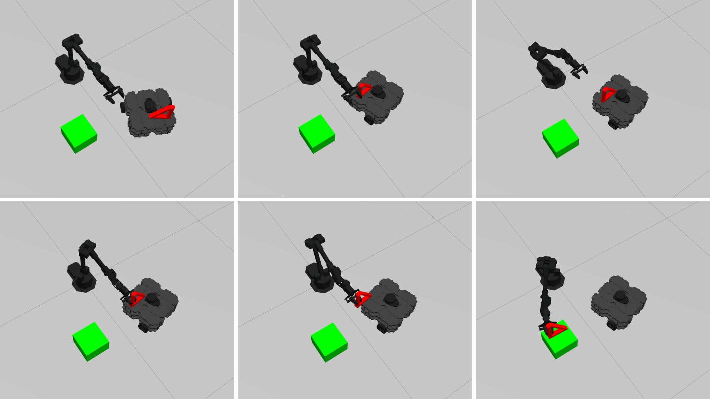
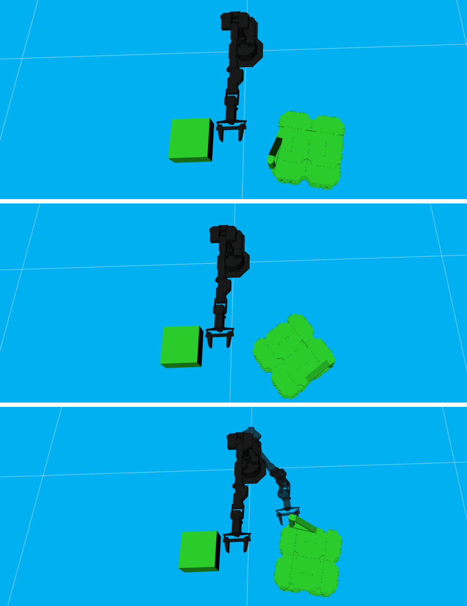

# Cooperação entre Robô Móvel e Braço Robótico para Tarefas de Pick and Place

Este repositório apresenta a implementação utilizada no artigo **"Collaboration between UGV and robotic arm for pick and place tasks"**.

O foco principal deste projeto é desenvolver uma simulação que demonstre a cooperação entre o robô móvel TurtleBot3 e o braço robótico WidowX-250S na execução de tarefas de manipulação de objetos. Para isso, foi implementado um algoritmo de reorientação do robô móvel, permitindo que o UGV ajuste sua orientação no ambiente para possibilitar a cooperação com o manipulador robótico durante uma tarefa de pick and place com objetos assimétricos.

O trabalho completo pode ser acessado em: https://ieeexplore.ieee.org/document/11066164

- Demonstração da simulação de cooperação entre o TurtleBot3 e o braço robótico WidowX-250S no Gazebo:

  

- Demonstração do algoritmo de reorientação do UGV no MoveIt:
  <p align="center">
    
  </p>
---

## Arquitetura do Sistema

O sistema é baseado na comunicação entre diferentes nós do ROS, responsáveis pela navegação do robô móvel e pela manipulação do objeto pelo braço robótico.
  
O fluxo de execução ocorre da seguinte forma:

1. Inicialização do ambiente de simulação no Gazebo.
2. Navegação do robô móvel até a área de manipulação.
3. Execução do algoritmo de reorientação do robô móvel.
4. Planejamento de movimento do braço robótico utilizando MoveIt.
5. Execução da tarefa de pick and place.


## Índice

- [Arquitetura do Sistema](#arquitetura-do-sistema)  
- [Pré-requisitos](#pré-requisitos)  
- [Instalação](#instalação)  
- [Execução ](#execução)  

## Pré-requisitos

Antes de começar, certifique-se de que você tenha o seguinte instalado e configurado:

- [ROS Noetic](http://wiki.ros.org/noetic/Installation/Ubuntu) (Ubuntu 20.04)
- Python 3
- RViz
- Gazebo
- [MoveIt](https://moveit.ai/install/)

## Instalação
Siga estas etapas para configurar o ambiente de simulação:

1. Clone o repositório do braço robótico para o seu workspace ROS:
   
    Faça o download dos pacotes fornecidos pelo fabricante do braço robótico WidowX-250s.
   ```bash
   cd ~/catkin_ws/src && git clone https://github.com/Interbotix/interbotix_ros_manipulators.git
   cd ~/catkin_ws/src/interbotix_ros_manipulators/interbotix_ros_xsarms && rm CATKIN_IGNORE
   cd ~/catkin_ws/src && git clone https://github.com/Interbotix/interbotix_ros_core.git
   cd ~/catkin_ws/src/interbotix_ros_core/interbotix_ros_xseries && rm CATKIN_IGNORE 
   cd ~/catkin_ws/src && git clone https://github.com/Interbotix/interbotix_ros_toolboxes.git
   cd ~/catkin_ws/src/interbotix_ros_toolboxes/interbotix_xs_toolbox && rm CATKIN_IGNORE 
   cd ~/catkin_ws
   catkin_make
   source devel/setup.bash 

2. Clone o repositório do Turtlebot3 para o seu workspace ROS:

    Faça o download dos pacotes fornecidos pelo fabricante do Turtlebot3.
   
   ```bash
   cd ~/catkin_ws/src
   git clone https://github.com/ROBOTIS-GIT/turtlebot3.git
   git clone https://github.com/ROBOTIS-GIT/turtlebot3_simulations.git
   cd ~/catkin_ws
   catkin_make
   source devel/setup.bash
3. Clone o pacote `gazebo_ros_link_attacher`

Neste projeto, esse pacote é empregado para manter o objeto ligado ao TurtleBot3 enquanto o robô se desloca.
```bash
cd ~/catkin_ws/src
git clone https://github.com/pal-robotics/gazebo_ros_link_attacher.git
cd ~/catkin_ws
catkin_make
source devel/setup.bash
```

O pacote disponibiliza serviços ROS para anexar e desanexar links de modelos no Gazebo, sendo utilizado neste trabalho para representar a fixação temporária do objeto ao TurtleBot3 durante a etapa de navegação.


4. Clone o repositório de cooperação para o seu workspace ROS:
   
    Por fim, instale este repositório, que contém a implementação do algoritmo de reorientação do robô móvel e os arquivos responsáveis pela integração entre o WidowX-250S e o TurtleBot3:
   ```bash
   cd ~/catkin_ws/src
   git clone https://github.com/agloiola/Collaboration-for-pick-and-place-tasks.git
   cd ~/catkin_ws
   catkin_make
   source devel/setup.bash
## Execução

Após concluir a instalação de todos os pacotes, siga os passos abaixo para executar a simulação do sistema cooperativo:

1. Inicie o ambiente de simulação:


   Primeiro, inicie o ambiente no Gazebo, juntamente com o mapa e o MoveIt:
   ```bash
   roslaunch Collaboration-for-pick-and-place-tasks wx250s_turtlebot3.launch
   
Este comando inicializa o ambiente de simulação no Gazebo, contendo o braço robótico e o robô móvel, além do RViz e do MoveIt, que são utilizados para planejar e executar os movimentos do braço robótico, e o mapa do ambiente de simulação para a navegação do TurtleBot3.

2. Execute o algoritmo de pick and place com reorientação do robô móvel
   
   Abra um novo um terminal e execute o comando a seguir para iniciar o mapa do ambiente de simulação:
   ```bash
   roslaunch Collaboration-for-pick-and-place-tasks cooperation_algoritmo.launch

Este comando inicializa todo o sistema cooperativo, incluindo navegação, reorientação do robô móvel e a execução da tarefa de pick and place.

